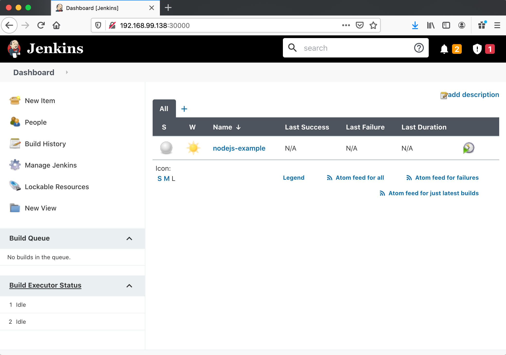

# DevOps Engineer Assessment

In order to accomplish the demo assessment, I use the following technologies:

- Virtualbox as a platform for running Minikube
- Minikube as a ready to use Kubernetes cluster
- Jenkins Community Kubernetes Helm Charts to deploy Jenkins on the Kubernetus cluster
- Terraform with hashicorp/kubernetes and hashicorp/helm providers to automate my Jenkins deployment
- Kubernetes command-line tool(kubectl) to get nessesary information after Jenkins deployment
- Kubernetes plugin for Jenkins to run Jenkins agents dynamicly on the Kubernetes cluster and use the compute power only whenever needed to build something
- Jenkins Configuration as Code (JCasC) Plugin to configure Kubernetes plugin and set up a test pipeline job
- Small nodejs github project with Jenkinsfile to be triggered by the pipeline job
- Jenkins and nodejs Docker containers from Docker Hub

I was striving to keep the demo clean, concise and easy to reproduce, so I decided to leverage Jenkins Kubernetes Helm Charts as much as possible for the things like:
- Creating Kubernetes Persistent Volume and Persistent Volume Claim for Jenkins controller pod to prevent losing configuration of the Jenkins controller and our jobs when we reboot minikube.
- Creating ServiceAccount and enable RBAC (using pre-installed jenkins namespaces) to allow Jenkins scheduling of agents via Kubernetes plugin
- Use NodePort Service with static port 30000 to expose Jenkins outside and create network routes automatically
- Set some resources limitations for Jenkins controller
- Install minimal set of Jenkins plugins

Stating:
The instructions below will produce a Jenkins instance on kubernetes where this repository will be produced as a self cloned and testable job therein.

:warning: :no_entry: :radioactive:
The setup is for testing purpose only. Not for production use.
:warning: :no_entry: :radioactive:

Enough rambling lets try it out.

## How to reproduce

### Requirements

#### Hardware
2 CPUs<br>
4GB of free memory<br>
20GB of free disk space<br>

#### Software
[Virtualbox](https://www.virtualbox.org/wiki/Downloads)<br>
[Minikube](https://minikube.sigs.k8s.io/docs/start/)<br>
[Terraform](https://www.terraform.io/downloads.html) >= v0.12.x<br>
[kubectl](https://kubernetes.io/docs/tasks/tools/install-kubectl/)<br>

### Steps to reproduce
Spin up the Kubernetes cluster:
```
minikube --memory 4096 --cpus 2 start --vm-driver=virtualbox
```

Clone this repository and apply terraform commands:
```  
terraform init
terraform plan
terraform apply -auto-approve
```

After the installation get the Jenkins ip-address, the port is 30000:
```
kubectl get nodes --namespace jenkins -o jsonpath="{.items[0].status.addresses[0].address}"
```

And get Jenkins 'admin' user password:
```
kubectl exec --namespace jenkins -it jenkins-0 -c jenkins -- /bin/cat /run/secrets/chart-admin-password && echo
```

Open http://jenkins_ip-address:30000 and run the nodejs-example pipeline job.<br>
<br>

<br>

The job will clone the https://github.com/y0j/node_js-example repository, install and run a test for the project.

## Further Development
Configure domain name for Jenkins controller
Configure TLS for the Jenkins domain name
Configure Jenkins key store and internal TLS connection between Jenkis controller and agents
Create jenkins users, not use 'admin' for building pipelines
Creation of Kubernetes network policy resource to specify from which CIDRs the agents can be connected to the controller
Install Jenkins on EKS or GKE cluster for better availability and scalability, use NFS instead of hostPath for PersistentVolume and configure agent resource usage according to the setup goal

## Links which helps me a lot
[Installing Jenkins on Kubernetes](https://www.jenkins.io/doc/book/installing/kubernetes/)<br>
[Jenkins Pipeline](https://www.jenkins.io/doc/book/pipeline/)<br>
[Jenkins Community Kubernetes Helm Charts](https://github.com/jenkinsci/helm-charts)<br>
[Jenkins Configuration as Code Plugin](https://github.com/jenkinsci/configuration-as-code-plugin)<br>
[JEP-201: Jenkins Configuration as Code](https://github.com/jenkinsci/jep/tree/master/jep/201)<br>
[Configure Kubernetes plugin](https://github.com/jenkinsci/configuration-as-code-plugin/tree/master/demos/kubernetes)<br>
[Kubernetes plugin for Jenkins](https://github.com/jenkinsci/kubernetes-plugin)<br>
[Kubernetes plugin for Jenkins examples](https://github.com/jenkinsci/kubernetes-plugin/tree/master/examples)<br>
[Jenkins on Kubernetes Engine](https://cloud.google.com/solutions/jenkins-on-kubernetes-engine)<br>
[Continuous Delivery to Kubernetes with Jenkins and Helm](https://www.youtube.com/watch?v=xzbMHj1ly9c)<br>
[Ewelina Wilkosz - How to use Jenkins Configuration as Code](https://www.youtube.com/watch?v=QdJIv1qDYcg)<br>
[Online Meetup: Configuration as Code of Jenkins (for Kubernetes)](https://www.youtube.com/watch?v=KB7thPsG9VA)<br>
[Jenkins on Kubernetes: Getting started](https://www.youtube.com/watch?v=h4hKSXjCqyI)<br>
[Helm(ed) Jenkins for k8s in details](https://medium.com/@alexshulyak/helm-ed-jenkins-for-k8s-in-details-6b286a3a894f)<br>
Many more less significant from google search<br>
